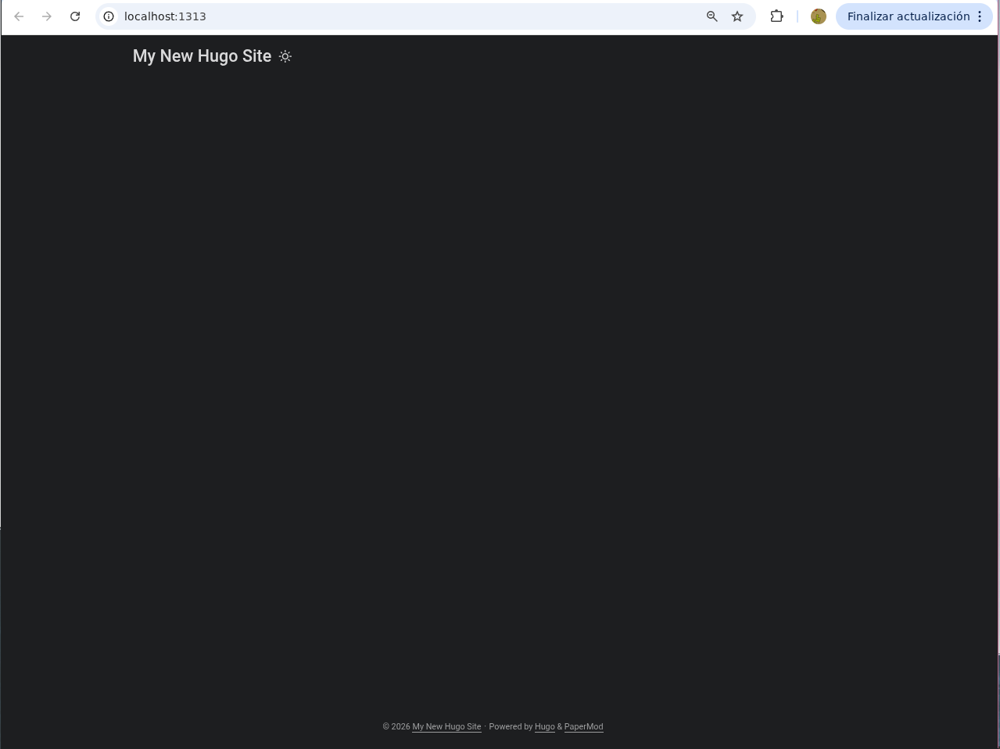

Puede ser para muchos interesante el hecho crear su propia página web y poner en ella lo que sea que uno quiera, o al menos para mi siempre lo fue.

Hacer este sitio básico solo me llevó un día y la verdad es que por el poco tiempo que lleva creo que es algo que vale totalmente la pena.  

Al día de la fecha de esta nota, este blog solamente cuenta con dos artículos, y ninguna estructura compleja. Puedo empezar a nombrar las siguientes:  


### Características
- **Alojamiento completamente gratuito** no me cuesta nada tenerlo arriba, lo único necesario es tener una cuenta de github.
- **Simple creación de contenido** Crear una nueva publicación no es más que crear una nueva nota en mi editor de notas [obsidian](https://obsidian.md/) y hacer un commit.
- **Simple edición y manejo de contenido** Como todo está escrito en [Markdown](https://es.wikipedia.org/wiki/Markdown) no tengo que preocuparme por darle estilo o linkear los contenidos.  
Para no dar muchas más vueltas vamos a empezar con los  

### Requisitos necesarios
- Estar familiarizado con herramientas de desarrollo de software como Git y linea de comandos.
- Instalar [Git](https://git-scm.com/install/) y tener una cuenta de [Github](https://github.com/) para hostear nuestro sitio
- Instalar [Obsidian](https://help.obsidian.md/install) (o cualquier otra herramienta para la escritura de MD)
- Instalar [Hugo](https://gohugo.io/installation/) para transformar nuestros archivos MD archvios que pueda leer un navegador. (Importante, tiene que ser la versión extended y superior a v0.146)

Una vez que ya hiciste todo eso podemos empezar con lo básico.  

---  

### Paso 1 - Crear y configurar un nuevo repositorio
Para esto vamos a seguir los pasos 1 al 9 que nos indica detalladamente [la wiki de github pages](https://docs.github.com/es/pages/quickstart) y vas a seleccionar la rama main y el directorio /docs como base desde la que se van a tomar los archivos estáticos.  

Una vez que terminemos este paso deberíamos tener un repositorio con esta pinta

  

Esta es una reversión al primer commit así que no van a ver ningún deployment hecho todavía.

Una vez hecho esto toca clonar el repositorio en tu máquina local de la forma que prefieras.

Cuando eso esté hecho vas a crear un nuevo archivo llamado docs/index.html con el contenido que prefieras, por ejemplo
```html
<h1>¡Hola, Mundo!</h1>
```

Hecho esto vas a hacer un commit y publicarlo en tu rama main. Esto va a disparar la acción de construir y publicar tu sitio. Pasados máximo unos 10 minutos vas a poder ver el resultado en https://tu_usuario.github.io/  

### 2 - Crear un nuevo proyecto con Hugo
Suponiendo que ya instalaste [hugo](https://gohugo.io/) te vas a parar en la carpeta tu repositorio y correr los siguientes comandos (Para windows y MacOS debería ser similar):
```bash
hugo new site quickstart --format yaml
mv quickstart/* .
rmdir quickstart
git submodule add --depth=1 https://github.com/adityatelange/hugo-PaperMod.git themes/PaperMod
git submodule update --init --recursive
git submodule update --remote --merge
echo "theme: ["PaperMod"]" >> hugo.yaml
hugo server
```

Felicitaciones, ahora tu sitio corre localmente en el puerto que te muestra el servidor de pruebas de Hugo. En él vas a poder ver el tiempo real cómo está quedando tu sitio a medida que lo modifiques.
  

Para crear el primer post vamos a usar la el comando
```bash
hugo new content content/posts/hola-mundo.md
```
Esto te va a crear un draft con alguna información básica que podés rellenar y dejar en algo del estilo:

```Markdown
---
date: {{date}}
draft: true
title: '¡Hola, Mundo!'
---

Este es mi primer post, y esperemos que sigan muchos más.

---
Créditos para [Hugo](https://gohugo.io) que soporta la creación de archívos estáticos para este sito.

Y también para la asombrosa plantilla [PaperMod](https://github.com/adityatelange/hugo-PaperMod) que voy a estar usando.

```

Solo asegurate de dejar el contenido de arriba que va entre "---" bien formateado tal cual lo dejó hugo new content. Ahora levantamos el server de manera que nos tome este post, aunque sea un draft aún (notá que podés cambiar esto pasando draft de true a false)

```bash
hugo server -D
```
Con esto ya deberías poder ver tu primer artículo en tu sitio web. Felicitaciones.

### 3 - Integración de Hugo con Github pages
Ahora que ya tenemos nuestro sitio bonito y estilizado, es hora que estos cambios se vean reflejados en nuestro servidor de github pages.

El primer paso es modificar el archivo de configuración de hugo:
```yaml
baseURL: https://tu_usuario.github.io/
languageCode: es
defaultContentLanguage: es
title: Mi Primer Blog
theme: ["PaperMod"]
publishDir: docs
```

Con esto vamos a conseguir que el output de hugo se genere en el directorio /docs, que es el que lee github pages por defecto.
No te olvides de cambiar tu_usuario en baseURL para el correcto funcionamiento de los links en tu sitio.

Una vez hecho esto, toca generar todos los archivos al nuevo directorio y borrar el anterior. 
```bash
hugo
rm -r public
```
Podés ver como quedó todo con hugo server. Si algo no llega a estar, verificá que lo hayas marcado como draft: false.

Ahora hacermos un nuevo commit de la manera que nos quede cómoda y verificamos que en nuestro repositorio los archivos de /docs hayan quedado más o menos de esta manera:
  

Y en unos minutos deberíamos poder ver los cambios en la url de github pages. En caso de no ser así, podemos chequear los trabajos se hayan completado en
https://github.com/tu_usuario/tu_usuario.github.io/actions.  


